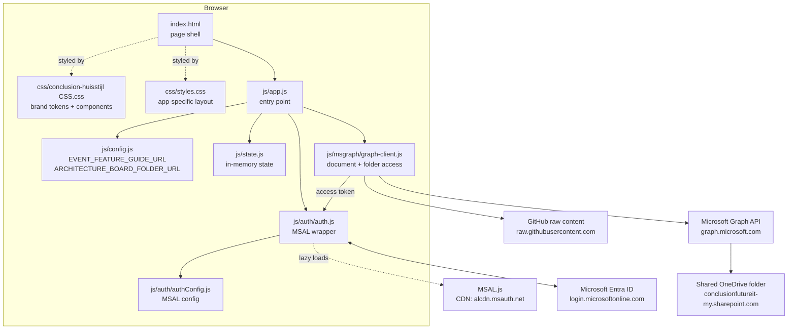
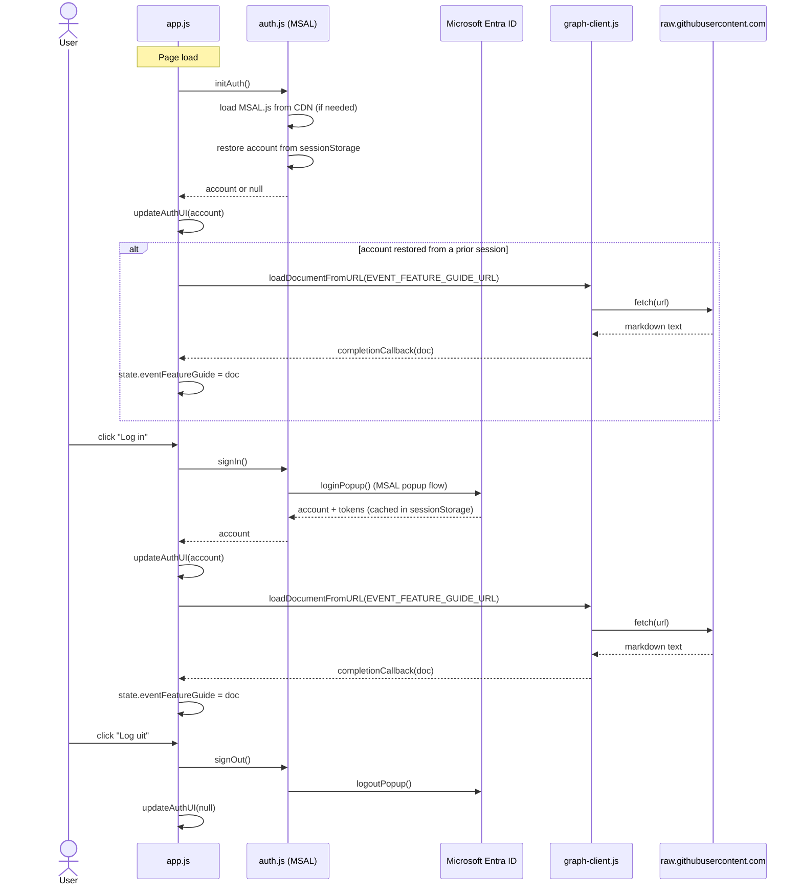
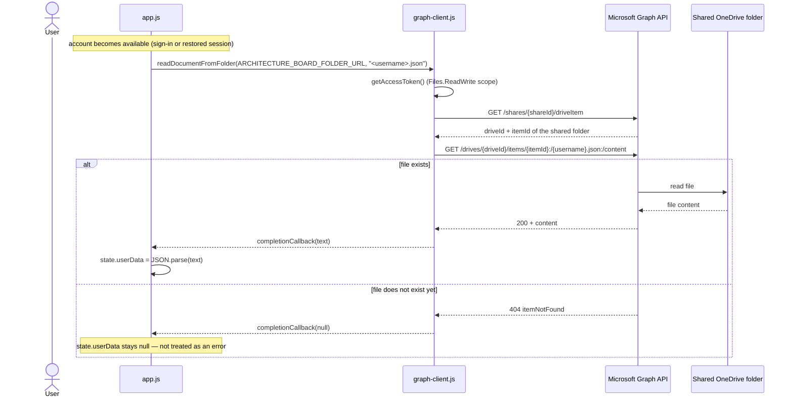

# Architecture — Conclusion Architecture Board

Audience: software architects. This document describes the current
architecture, the rationale behind the choices made, and the constraints to
respect when evolving the application.

## 1. Summary

The Conclusion Architecture Board is a **static, client-side web application**:
plain HTML/CSS/JavaScript, no server-side component, no build pipeline, no
package manager. It is currently a thin shell — a branded landing page plus
Microsoft Entra ID sign-in — that establishes the foundations (styling,
identity, a state container, and two data-fetch patterns: a public GitHub
document, and a per-user JSON document read from — and, for authorized users,
writable to — a shared OneDrive folder) on which the actual Architecture
Board functionality will be built.

The application is a sibling of an existing project, **mjp-viewer**, and
deliberately reuses its patterns (module layout and the `state.js`
convention) so the two apps stay consistent and maintainable as a small
family of related internal tools. It has its own Entra ID app registration,
separate from `mjp-viewer`'s.

## 2. Architecture style

- **Static site, no backend.** All logic runs in the browser. There is no
  server-side rendering, no API layer, and no database owned by this
  application.
- **No build step.** Files are served as-authored; ES modules (`import`/
  `export`) provide modularity instead of a bundler. This keeps the
  deployment surface minimal (any static file host works) at the cost of
  build-time optimizations (tree-shaking, minification, TypeScript) that a
  toolchain would normally provide.
- **Vanilla JS over a framework.** No React/Vue/etc. Given the current scope
  (a handful of DOM elements and one async flow), a framework would add
  weight without clear benefit. This should be revisited if the UI grows into
  something with significant client-side state and interaction (see §7).
- **Identity via Microsoft Entra ID, client-side only.** Authentication is
  used to *identify* the user and *unlock a document fetch*; no backend
  validates tokens, and no content is currently access-controlled server-side
  (there is no server). This is an important distinction from a typical
  "protected app" — see §5.

## 3. Component view

**Module responsibilities**

| Module | Responsibility |
|---|---|
| `index.html` | Structure only — header/logo, hero, about section, auth controls. No logic. |
| `css/conclusion-huisstijl CSS.css` | Corporate design system: colors, type scale, spacing, reusable components (buttons, cards, nav). Treated as a vendored asset, not edited for app-specific needs. |
| `css/styles.css` | Small, app-specific layout additions that sit on top of the house style. |
| `images/` | Static image assets (currently just the Conclusion logo). |
| `js/app.js` | Composition root. Wires DOM event handlers to the auth module, drives the post-login document + per-user file fetch, and is the only module that touches `document.*`. |
| `js/config.js` | Static configuration — the URL of the public reference document, and the URL of the shared OneDrive folder used for per-user data. |
| `js/state.js` | Single shared mutable state object, imported by reference (ES module live bindings) wherever shared state is needed. |
| `js/auth/authConfig.js` | Entra ID app registration details (client ID, tenant/authority, requested scopes). The only file to change to point at a different tenant or app registration. |
| `js/auth/auth.js` | Thin wrapper around MSAL.js: session restore, sign-in, sign-out, silent token acquisition. No DOM access — reusable in any future page. |
| `js/msgraph/graph-client.js` | Fetches a document from a plain/GitHub/OneDrive URL; also lists, reads, and writes files in a shared OneDrive folder via the Microsoft Graph `/shares` and `/drives` endpoints. |

## 4. Key flow: sign-in → document fetch

Notes:
- The document fetch is triggered on **any** state where `getAccount()`
  returns a truthy account — including a session silently restored from
  `sessionStorage` on page load, not only an explicit interactive sign-in.
- The fetched document (`raw.githubusercontent.com/.../EVENT_FEATURE_GUIDE.md`)
  is public; the fetch itself does not require an access token.

## 4a. Key flow: per-user document in the shared OneDrive folder

Alongside the GitHub fetch, the same sign-in event triggers a lookup for a
document private to that user, stored in a shared OneDrive folder:

For a user with write access, the same folder can be written back to via
`writeDocumentToFolder(ARCHITECTURE_BOARD_FOLDER_URL, "<username>.json", JSON.stringify(data))`
— not currently wired to any UI action, but available as a building block for
a future "save my data" feature. `listFolderContents()` similarly exists as a
building block for a future folder browser and is not yet called from `app.js`.

## 5. Identity and security model

- **Auth protocol**: OAuth 2.0 / OIDC via Microsoft Entra ID, implemented with
  MSAL.js's `PublicClientApplication` (SPA / public client, popup flow — no
  client secret, appropriate for a browser-only app).
- **Token cache**: `sessionStorage` (tab-scoped, cleared when the tab closes).
- **Scopes requested**: `User.Read`, `openid`, `profile`, `Files.ReadWrite`.
  The first three are used for basic sign-in and display name;
  `Files.ReadWrite` is required so `graph-client.js` can both read from and
  write to the shared OneDrive folder on the user's behalf.
- **What sign-in protects, for the GitHub document**: nothing. The page
  renders fully before and without sign-in; the reference document lives at
  a public URL. Sign-in there serves to (a) identify the user in the UI and
  (b) gate *when* the fetch happens, not *whether* the content is accessible.
- **What sign-in protects, for the OneDrive folder**: real access control,
  delegated to OneDrive/SharePoint sharing permissions — not to any logic in
  this app. `graph-client.js` always calls the Graph API with the signed-in
  user's own delegated access token (`acquireTokenSilent`), so a user can
  only read or write files in `ARCHITECTURE_BOARD_FOLDER_URL` to the extent
  the folder is actually shared with them in OneDrive. The `<username>.json`
  naming convention keeps each user's file logically separate, but it is
  **not an enforced boundary** — anyone with write access to the folder can
  read or overwrite any other user's file by name. That's an acceptable
  trade-off for a small, trusted internal-tool folder; it would not be
  appropriate if the folder ever holds sensitive per-user data or needs
  per-file access control, which OneDrive folder-level sharing cannot express.
- **Dedicated app registration.** This app has its own Entra ID app
  registration (tenant `21429da9-...`, distinct from `mjp-viewer`'s), so its
  redirect URIs and scope consent are managed independently. Recorded in
  `js/auth/authConfig.js`.
- **No secrets in the codebase.** The client ID and tenant ID are not secret
  (public client apps identify themselves this way by design); nothing in
  this repository should ever contain a client secret or access token.

## 6. Deployment

The app has no server-side runtime requirement: it can be hosted on any
static file host (e.g., Azure Static Web Apps, GitHub Pages, an S3/Blob
bucket behind a CDN, or a simple web server) as long as:

1. The host serves files over HTTP(S) — ES modules do not load from
   `file://`.
2. The redirect URI configured in `authConfig.js`
   (`window.location.origin`) is registered as an allowed redirect URI on the
   Entra ID app registration for whichever origin(s) the app is deployed to
   (e.g., `https://<something>.azurestaticapps.net`, a custom domain, and
   `http://localhost:*` for local development).
3. Outbound requests to `alcdn.msauth.net` (MSAL CDN),
   `login.microsoftonline.com` (Entra ID), `raw.githubusercontent.com`
   (document source), `graph.microsoft.com` (Microsoft Graph), and
   `*.sharepoint.com` (the shared OneDrive folder) are not blocked by network
   policy at the hosting or client-network level.

There is currently no CI/CD pipeline, environment separation, or
infrastructure-as-code in this repository — deployment is "copy the static
files to a host."

## 7. Constraints and evolution notes

- **Keep it static as long as reasonably possible.** The current scope (view
  a document, sign in to identify the user) does not need a backend. Introduce
  one only when a real requirement demands server-side logic: genuine access
  control, write operations that must be authorized and audited, or
  aggregation across multiple users' data.
- **`state.js` will grow.** As the Architecture Board's real functionality
  (viewing/editing architecture content) is built, expect `state.js` to
  accumulate more properties, following the same "one shared mutable object,
  imported by reference" pattern already used for `eventFeatureGuide`. This
  mirrors `mjp-viewer`'s `state.js`, which holds considerably more state for a
  richer feature set — useful as a reference for how the pattern scales.
- **Reconsider vanilla JS if interaction complexity grows.** The current
  module count and DOM surface area are small enough that plain ES modules
  are the right level of complexity. If the Architecture Board evolves into a
  rich, stateful editor (as `mjp-viewer` did, with tree navigation, search,
  and multiple tabbed views all in vanilla JS), watch for the point where a
  lightweight framework or at least a component-rendering convention would
  reduce accidental complexity — `mjp-viewer` is a useful data point on how
  far the vanilla approach can be pushed before it gets unwieldy.
- **The house style stylesheet is a shared brand asset.** Treat
  `css/conclusion-huisstijl CSS.css` as read-mostly; app-specific styling
  belongs in `css/styles.css`. If multiple internal apps end up sharing it,
  consider hosting it centrally (e.g., a shared static asset URL) rather than
  copying the file into each project, to avoid brand-update drift.
